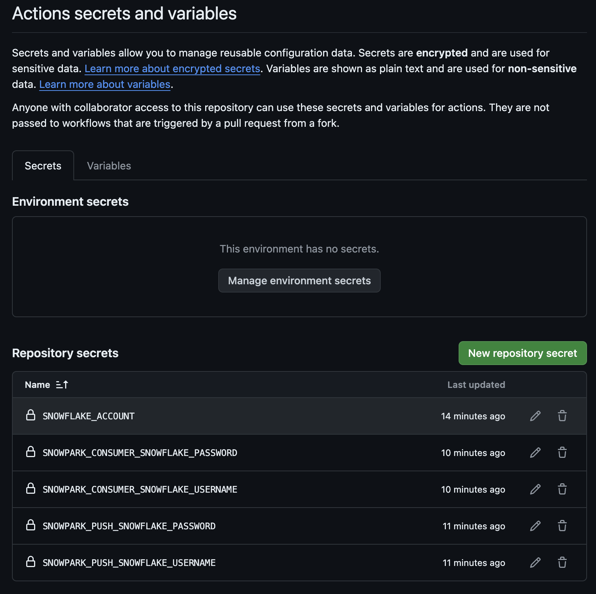
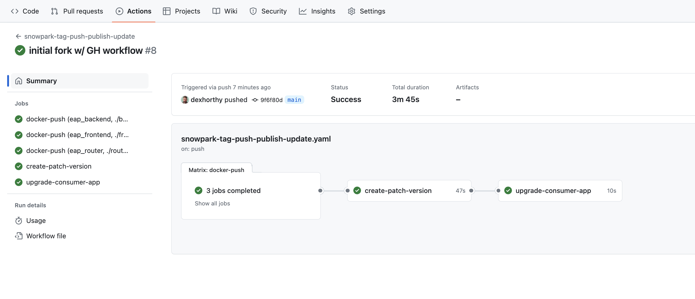
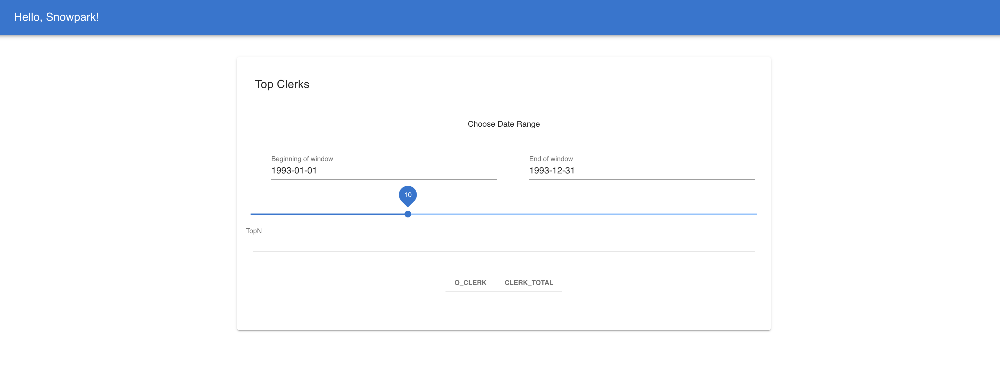

# Build a Native App with SPCS

## Overview


In this guide you will learn how to incorporate Snowpark Container Services into a Native App allowing you to deploy a variety of new capabilities to Native App consumers.


## Step-By-Step Guide

For prerequisites, environment setup, step-by-step guide and instructions, please refer to the [QuickStart Guide](https://quickstarts.snowflake.com/guide/build-a-native-app-with-spcs/index.html).

This fork includes GitHub actions for CI/CD w/ the Snowpark Native app. 
Once you've gone through the Quickstart Guide above, you can follow the [GitHub Actions setup](#github-actions-setup) to
get things working with GitHub Actions. If you did the "delete everything" steps at the end of the guide, you'll want to go back in and recreate everything, and validate you can access the running application.

See the [blog post draft](https://docs.google.com/document/d/1fTHpKovtuCUSGwNrdDbwOyJMJvByzGtZpRAkZ9leUng/edit) for more background and motivations behind this project.

**Note** this also includes a few tweaks and fixes to the lab setup script to fix some issues related to changes in the snowflake platform since the quickstart guide was published.

## GitHub Actions Setup

Again, assuming you've gone through the other work in the Quickstart Guide, you can now set up GitHub Actions to build and deploy your Native App. All the assets you need are already here in this repository, including the SQL steps in [./scripts/github_actions_script.sql](./scripts/github_actions_script.sql) and the workflow in [./.github/workflows/snowpark-tag-push-publish-update.yaml](./.github/workflows/snowpark-tag-push-publish-update.yaml).

### 1.1 Create Packager User

To start, you'll need to create users in snowflake to assume the roles of app packager and app consumer.

You'll use these narrowly-scoped user accounts + credentials to authenticate with Snowflake when

1. (packager) pushing docker containers
2. (packager) publishing new patch versions of the native app package
3. (consumer) installing/deploying the updated patch version of the native app package

You can run the SQL in [./scripts/github_actions_script.sql](./scripts/github_actions_script.sql) to create these users.
They rely on existing roles and warehouses created in the [Quickstart Guide](https://quickstarts.snowflake.com/guide/build-a-native-app-with-spcs/index.html).

```sql

use role accountadmin;

create user naspcs_user
    default_role = naspcs_role
    default_warehouse = wh_nap;
grant role naspcs_role to user naspcs_user;

alter user naspcs_user set password = -- finish me, or set password however you prefer
;
```

### 1.2 Test Packager User

you can test the NASPCS_USER account doing a `docker login` and validating the user has push access
to the registry

```sh
docker login $SNOWFLAKE_REPO --username naspcs_user
make all
```

### 2.1 Create Consumer User

Similarly, run the following to create a user for the 

```sql
use role accountadmin;

create user nac_user
    default_role = nac
    default_warehouse = wh_nac;
grant role nac to user nac_user;

alter user nac_user set password = -- finish me, or set password however you prefer
;
```

### 2.2 Test Consumer User

You can test the consumer user by getting your service endpoint and attempting to log into using these
credentials.

```sql
use application spcs_app_instance;
call app_public.app_url();
```

### 3.1 Configuring GitHub to store Snowflake credentials

Next, we need to configure GitHub actions secrets to allow GitHub to act on behalf of the users we created.
You'll need admin on the repo where you set secrets.

We'll use the simpler [Repository Secrets](https://docs.github.com/en/actions/security-guides/using-secrets-in-github-actions#creating-secrets-for-a-repository) method, but you're welcome to use any other secret method if you know what you're doing.

We'll set 5 secrets:

1. `SNOWFLAKE_ACCOUNT` - the account identifier, e.g. `smfohxh-sg25239`
2. `SNOWPARK_PUSH_SNOWFLAKE_USERNAME` - the username for the packager user, e.g. `naspcs_user`
3. `SNOWPARK_PUSH_SNOWFLAKE_PASSWORD` - the password for the packager user
4. `SNOWPARK_CONSUMER_SNOWFLAKE_USERNAME` - the username for the consumer user, e.g. `nac_user`
5. `SNOWPARK_CONSUMER_SNOWFLAKE_PASSWORD` - the password for the consumer user

Your Repository's "Actions secrets and variables" section should look like this:



### 4.1 Make a local change to test the pipeline

Once your secrets are set, you can try a small change to this repo trigger a build. For example, lets
edit the file [./frontend/vue/src/App.vue](./frontend/vue/src/App.vue) and change the title of the app to `Hello, Snowpark!`.

```diff
<template>
  <v-app>
    <v-app-bar
      app
      color="primary"
      dark
    >
    <v-app-bar-nav-icon></v-app-bar-nav-icon>

-    <v-toolbar-title>Simple Clerks App</v-toolbar-title>
+    <v-toolbar-title>Hello, Snowpark!</v-toolbar-title>

  </v-app-bar>

    <v-main>
      <TopClerks/>
    </v-main>
  </v-app>
</template>
```

### 4.2 Commit, Push, and Merge

Commit, push, and merge the change to `main`.

### 4.3 Wait for Actions 

Wait for the actions to complete. You can view individual actions by clicking on the workflow run.



### 5.1 Access Application

And then you should see the new version of the app deployed to your service endpoint.



Remember, you can get the app URL with

```sql
use application spcs_app_instance;
call app_public.app_url();    
```

### 6.1 Teardown

In addition to the teardown steps in [./scripts/Lab_Script.sql](./scripts/Lab_Script.sql), you'll want to remove the users you created for the GitHub Actions setup, as documented in [./scripts/github_actions_script.sql](./scripts/github_actions_script.sql).

```sql
use role accountadmin;
drop user naspcs_user;
drop user nac_user;
```
